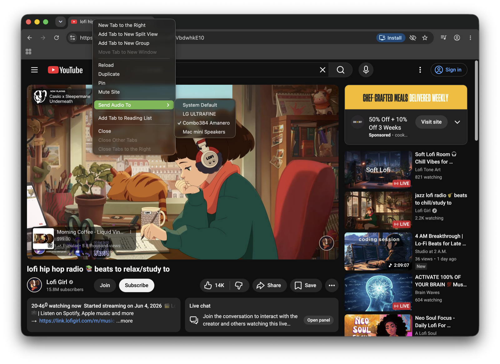

# Chromium Conductor

Conductor is my custom Apple silicon-only build of [ungoogled-chromium-macos](https://github.com/ungoogled-software/ungoogled-chromium-macos).

The goal is straightforward: Build a lean, optimized Apple silicon web browser, and add Core Audio routing features that are not available in Google Chrome, Chromium, or ungoogled-chromium-macos.



*Per-tab audio routing: sending a YouTube tab to a chosen Core Audio output device via the "Send Audio To" tab menu.*

## Key Features

- **Native Per-Tab Audio Routing**: Route different tabs to different audio devices simultaneously.
- **No Third-Party Virtual Cables**: Works natively via macOS Core Audio without needing external software.
- **Privacy-First Codebase**: Retains 100% of ungoogled-chromium's privacy defaults, and anti-telemetry protections.
- **Optimized for Apple silicon**: Built for ARM64 with ThinLTO compiler optimizations.

## Why?

Most of my listening happens via audio files, and physical media.

Every so often, I'll come across something on the web that deserves to be shot out to the stereo.

Conductor exists solely because I wanted the browser itself to have its own native, built-in audio routing, and not rely on third-party software.

## Custom Changes

This build currently includes two local patches.

### mac-audio-output-device-uid-switch.patch

Adds support for selecting a specific Core Audio output device.

This allows the browser to target a chosen audio device instead of relying entirely on the system default.

### mac-audio-output-device-tab-menu.patch

Adds a macOS-only **Send Audio To** submenu to the tab context menu.

Audio output can be assigned on a per-tab basis, and switched between available output devices.

## Build Configuration

The custom build profile is defined in:

```text
flags.macos.gn
```

Current goals include:

- native ARM64 builds
- ThinLTO optimization
- stripped symbols
- full media codec support
- reduced build overhead

## Build System

Builds are managed by:

```text
conductor.sh
```

The script handles:

- source retrieval
- patch application
- build verification
- clean rebuilds
- update rebuilds
- safety checks

My goal is to make Chromium builds predictable, repeatable, and easy to recover if something goes wrong.

### Notable Files

| File | Purpose |
|--------|--------|
| `conductor.sh` | Build and maintenance script |
| `flags.macos.gn` | Apple silicon build configuration |
| `patches.local/` | Local Chromium Conductor patches |
| `conductor.conf` | Local build configuration |

## Prerequisites

Chromium Conductor is developed and supported on **Apple silicon (ARM64) Macs** only.

While the build configuration exposes an `ARCH` setting in `conductor.conf`, Intel (`x64`) builds are neither tested nor supported.

### Hardware Requirements

Building Chromium is resource-intensive.

Recommended:

- 32 GB RAM minimum
- 64 GB RAM recommended
- 100 GB free disk space minimum
- 150 GB+ free disk space recommended
- Reliable internet connection

### Development Machine

Chromium Conductor is primarily developed on:

- Mac mini M4 Pro
- 64 GB RAM
- Current macOS release (macOS Tahoe 26.5.1 at time of project inception)

Build times will vary depending on hardware. Personally, in ~4 hours I have a completed build.

### Required Software

#### 1. Install Xcode

Install Xcode from the Mac App Store.

Launch Xcode once after installation, and allow any additional components to install. Xcode may also prompt you to accept Apple's license agreement.

#### 2. Install Xcode Command Line Tools

```bash
xcode-select --install
```

The Command Line Tools provide:

- git
- clang
- make
- xcode-select
- other standard developer tools used by Chromium's build system

#### 3. Install Homebrew

```bash
/bin/bash -c "$(curl -fsSL https://raw.githubusercontent.com/Homebrew/install/HEAD/install.sh)"
```

#### 4. Install GNU Coreutils

Chromium Conductor uses `greadlink`; it is provided by GNU Coreutils.

```bash
brew install coreutils
```

### Verify Your Environment

The following commands should all succeed:

```bash
xcode-select -p
brew --version
git --version
python3 --version
greadlink --version
```

Expected sources:

| Tool | Source |
|--------|--------|
| xcode-select | Xcode Command Line Tools |
| brew | Homebrew |
| git | Xcode Command Line Tools |
| python3 | macOS / Chromium tooling environment |
| greadlink | GNU Coreutils |

If any command fails, resolve the missing dependency before continuing.

### Quick Sanity Check

This command should report all required tools:

```bash
which git
which python3
which greadlink
which brew
```

Once everything above succeeds, you're ready to build Chromium Conductor. 🥳

## Getting Started

Create a working directory wherever you generally keep development projects.

As an example:

```bash
mkdir -p ~/Projects/Chromium-Conductor
cd ~/Projects/Chromium-Conductor
```

Clone the repository:

```bash
git clone https://github.com/works-by-maya/Chromium-Conductor.git
cd Chromium-Conductor
```

## Building

The initial build downloads Chromium source, toolchains, build dependencies, applies patches, generates build files, and compiles the browser.

A clean build can take several hours. If this is your first build, plan accordingly.

Every build contacts GitHub to discover the latest upstream ungoogled-chromium-macos release, then builds that release. Conductor always targets the current upstream macOS release; a first-time build therefore requires a network connection.

Initially, you build from scratch:

```bash
./conductor.sh
```

> **Warning — `./conductor.sh` performs a full clean rebuild.**
>
> It **deletes the generated checkout** (`ungoogled-chromium-macos/`) and rebuilds from scratch, which takes hours.
>
> I usually run this overnight or in the background while I work.
>
> If you are testing directly from the generated build output, quit that browser first. The script has safeguards for active build-output browsers, but it otherwise discards, and recreates the checkout.
>
> Once you already have a working build, use `--update-build` (below) to refresh it instead of starting over.

When the build finishes, you'll find the app at:

```text
ungoogled-chromium-macos/build/src/out/Default/Chromium.app
```

Install it by dragging `Chromium.app` into `/Applications`, or copy it from the terminal:

```bash
cp -R ungoogled-chromium-macos/build/src/out/Default/Chromium.app /Applications/
```

Verify build state:

```bash
./conductor.sh --verify-only
```

Check the currently available upstream release from ungoogled-chromium-macos:

```bash
./conductor.sh --check
```

Clean generated source and build artifacts:

```bash
./conductor.sh --clean
```

Update source and rebuild — use this once you already have a working checkout, instead of a full rebuild. It keeps the existing checkout, refreshes the generated source to the latest upstream release, reapplies patches, preserves the build cache where possible, and rebuilds. It requires an existing build; on a fresh clone it will tell you to run `./conductor.sh` first.

```bash
./conductor.sh --update-build
```

Show usage and all available commands:

```bash
./conductor.sh --help
```

## Status

Always under active development.

## Contributions

Chromium Conductor is a personal project built from a labor of love, and music.

I developed it solely for my own use, so I'm not accepting pull requests or external contributions at this time.

However, if you'd like to experiment with the ideas here, please feel free to fork the project to build your own version.

## Privacy

Conductor builds on ungoogled-chromium's privacy work, and doesn't undo any of it:

- No telemetry, no usage reporting, no crash uploads.
- No Google account integration or background sign-in.
- The audio routing feature stores your per-tab choices locally and sends nothing anywhere.

The points above describe the browser Conductor produces. Separately, the **build process** does use the network: it contacts GitHub to discover the latest upstream release and downloads the Chromium source and toolchains. That is required to build from source — it is not telemetry, and none of it happens when you run the resulting browser.

If you find behavior that contradicts any of the above, please open an issue — that's a bug, not a feature.

---

## Relationship to Chromium and ungoogled-chromium

Chromium Conductor is downstream of these projects and owes them everything except the local patches in `patches.local/`:

- **[Chromium](https://www.chromium.org/)** — the open-source browser engine, licensed under BSD-3-Clause.
- **[ungoogled-chromium](https://github.com/ungoogled-software/ungoogled-chromium)** — Chromium with Google integration removed and privacy defaults tightened.
- **[ungoogled-chromium-macos](https://github.com/ungoogled-software/ungoogled-chromium-macos)** — the macOS build of the above, and the base that `conductor.sh` clones and builds.

Conductor is neither affiliated with nor endorsed by Google or the ungoogled-software project. Please don't report Conductor-specific issues to those projects; they don't maintain Conductor's custom patches or build system.

---

## License

Chromium Conductor's own work — `conductor.sh`, `conductor.conf`, `flags.macos.gn`, and the patches in `patches.local/` — is licensed under the BSD-3-Clause license. See [`LICENSE`](LICENSE).

The Chromium source and the ungoogled-chromium modifications retain their existing licenses (Chromium is BSD-3-Clause; see the upstream `LICENSE` files).

---

## Acknowledgments

- The Chromium project and its contributors.
- The ungoogled-chromium maintainers, for the de-Googled base.
- The ungoogled-chromium-macos maintainers, for the Apple silicon build process `conductor.sh` stands on.